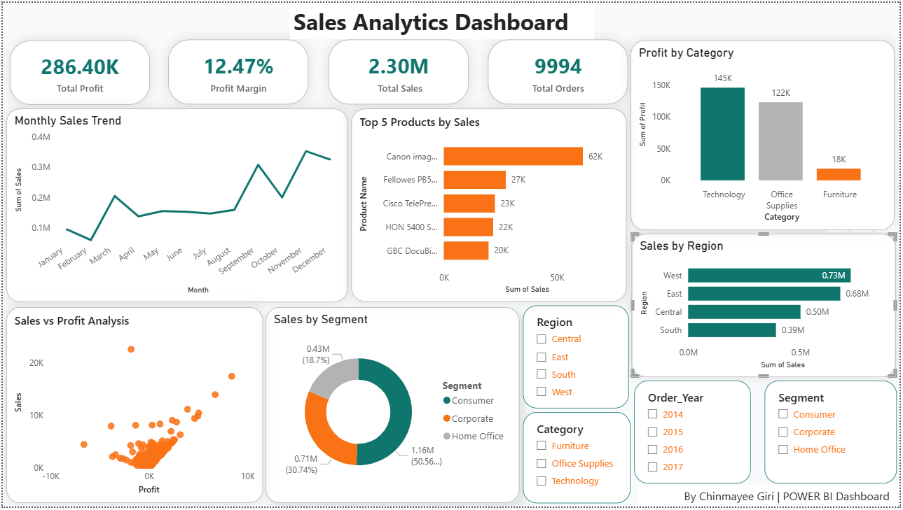
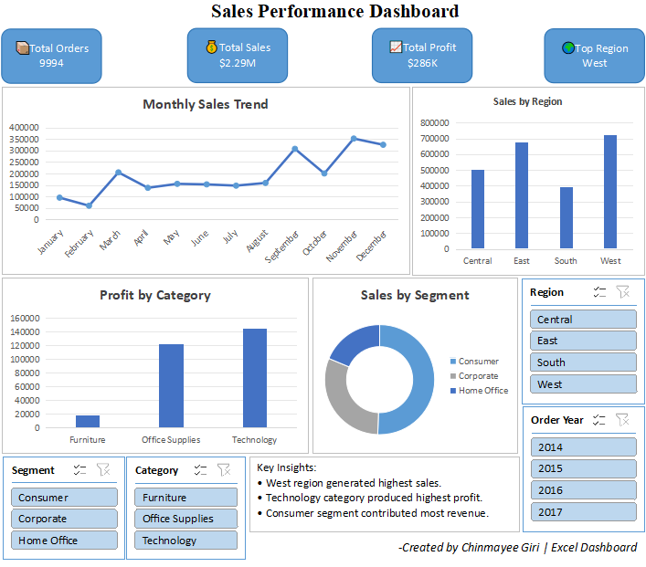

# Sales Analytics Dashboard

## Project Overview
Developed an end-to-end Sales Analytics project using Excel, SQL Server, and Power BI to analyze sales, profit, customer segments, and regional performance.

## Tools & Technologies
- Excel
- SQL Server
- Power BI
- DAX

## Project Workflow
1. Data cleaning and preprocessing in Excel
2. KPI analysis using Pivot Tables and Excel Dashboard
3. SQL analysis using SQL Server
4. Interactive dashboard development in Power BI

## Key Features
- KPI Cards
- Monthly Sales Trend Analysis
- Sales by Region
- Profit by Category
- Segment Analysis
- Interactive Slicers
- Business Insights

## KPIs
- Total Sales
- Total Profit
- Profit Margin
- Total Orders

## Dashboard Preview

### Power BI Dashboard

### Excel Dashboard

## Key Insights
- West region generated highest sales.
- Technology category produced highest profit.
- Consumer segment contributed most revenue.
- Sales peaked during November and December.

## Files Included
- Sales_Analytics_Dashboard.pbix
- Sales_Analytics_Excel_Dashboard.xlsx
- SQL_Queries.sql
- dataset.csv

## Author
Chinmayee Giri
